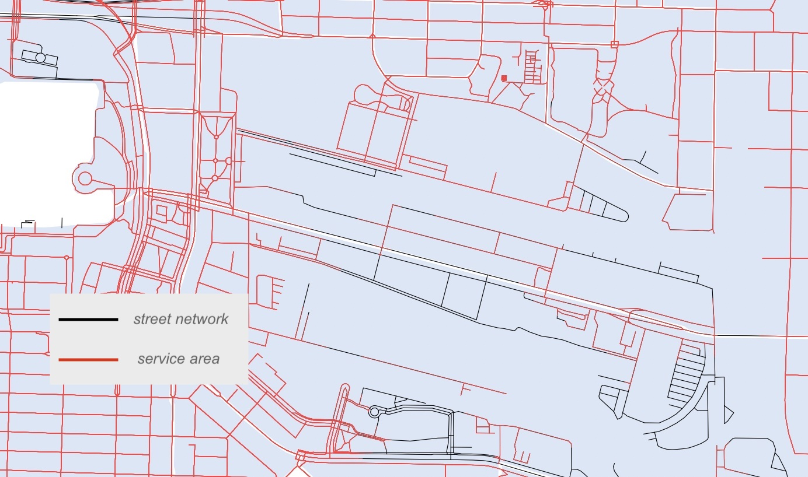
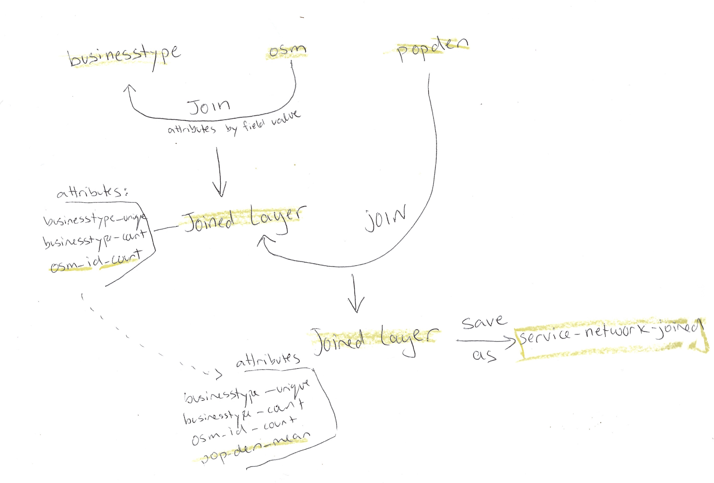
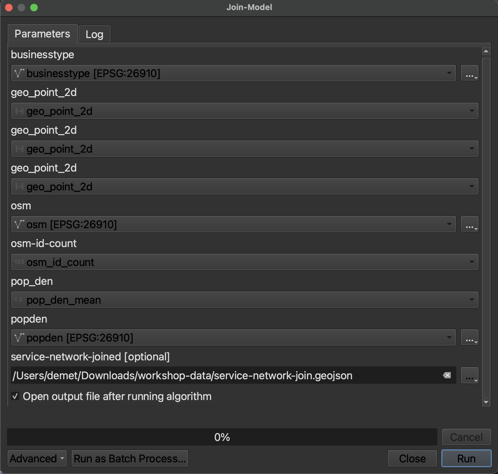

There are three parts to the following network analysis: 
- Extract service area 
- Buffer network inputs and join attributes 
- Calculate Z-scores    

The first step determines the portion of the street network within service area, i.e. within 300m distance from the center of any given urban block. In the second step, you will join information about businesses, street intersections, and population density to the service area network, then join to the area layer *urban-blocks*. In the final step, you will calculate z-scores to estimate walkability for each block.

---- 

# 1. Extract Service Area
This step determines the portions of the street network which are within 300 meters distance from the center of any given urban block.     

Run the tool **Service area (from layer)**    
>Vector layer representing network: *street-network*    
>Path type to calculate: Shortest    
>Vector layer with start points: *block-centroids*    
>Travel cost (distance): 300    
>Save output as ***service-area-network*** 

The output may appear the same at first glance, if you zoom in you'll see how the service area differs from the original street network:




----
# 2.  Buffer network inputs and join attributes  

This step joins attribute information about businesses, street intersections, and population density to the service area network. Because the layers *businesses* and *street-intersections* are point datatypes while *service-area-network* is composed of lines, a small buffer must first be run on *businesses* and *street-intersections* to create an area around each point. The undissolved buffers, retaining the attributes of each point they buffer, can then be spatially joined with the *service-area-network*. The summary of businesses and intersections within each buffer appended to the network's attribute table upon the two layers' spatial intersection.     

Once information regarding the number of unique businesses and intersections as well as mean population density has been joined to the network as it relates to any given portion of street, *service-area-network* can be joined to *urban-blocks* to merge field calculations to the area layer. *This whole step requires attention to many layers, so take your time as you work through the calculations.*
    

## Businesses
- Run a 50m **Buffer** on the pre-processed *businesses* layer. Do **not** dissolve result.     
>*If you get a warning while entering distance that your layer is in degrees, reproject your businesses layer to the Project CRS, EPSG:26910 - NAD83/UTM zone 10N* 

- **Join attributes by location (summary)**   
>Join to features in (base layer): *service-area-network*   <!--Join Features In was previously known as Base Layer-->     
>By comparing to (join layer): Buffered layer    
>Where the features (geometric predicate): intersect   
>Fields to summarize: "businesstype"    
>Summaries to calculate: 'count', 'unique'
    
  >When you run the tool, you may get an error "No spatial index exists for join layer, performance will be severely degraded." Do not worry about this. 

- In the Layers panel, right click the temporary output *Joined layer* and Rename Layer to *businesstype*       
    
- Remove *Buffered* layer

   

----
## Street Intersections

- Run a 50m **Buffer** on the processed layer *street_intersections*. Do **not** dissolve result 

- **Join attributes by location (summary)**        
>Join to features in:  *service-area-network*    
>By comparing to: Buffered layer    
>Where the features: intersect        
>Fields to summarize: "osm_id"     
>Summaries to calculate: 'count'       

- Rename the output *Joined layer* to *osm*     

- Remove *Buffered* layer 

    

----
## Census 

- **Join attributes by location (summary)**     
>Join to features in: *service-area-network*    
>By comparing to: *census*
>Fields to summarize: "pop_den"    
>Summaries to calculate: 'mean'     
    
- Rename the output *Joined layer* to *popden*     

---
## Join Attributes to Service Area Network
You should now have 3 temporary layers named *businesstype*, *osm*, and *popden*. In order to merge the field calculations performed above into one attribute table, a series of joins (as illustrated below) must be performed.     
   
  

While the following is the geoprocessing workflow to perform this series of joins consecutively, to save time, run the **Join Model** included in the workshop-data folder. From within the QGIS GUI, locate the model in your browser panel. Double click it to open. *(If you can't locate the join model within your workshop-data folder, click [HERE](./join-model.model3) to download it and move it into your workshop-data folder.)*    
    
Make sure the proper inputs are selected for each parameter, and save the output in your workshop-data folder as service-network-joined. Then hit run. 
    



  

<br>

```html
Optional workflow for above model:
    
- Run Join attributes by field value on *businesstype*      
        Input layer: businesstype   
        Table field: geo_point_2d
        Input layer 2: osm
        Table field 2: geo_point_2d   
        Layer 2 fields to copy: osm_id_count 

- Open the attribute table of the resulting Joined layer and 
ensure that "osm_id_count" now appears beside "businesstype_unique" and "businesstype_count"   
    

- Run Join attributes by field value on the Joined layer outputted from the step above    
      Input layer: Joined layer    
      Table field: geo_point_2d    
      Input layer 2: popden   
      Table field 2: geo_point_2d   
      Layer 2 fields to copy: pop_den_mean    
    
- The output layer of this join will be highlighted in the layers panel. 
Check the attribute table to ensure the fields "businesstype_unique" "businesstype_count" 
"osm_id_count" & "pop_den_mean" appear.

- Save this final Joined layer as a permanent layer called *service-network-joined*  

- Remove all temporary layers and save your QGIS project
```

----    
    

## Copy Fields to Urban Blocks 
Join summary fields from service area network to area layer

- **Join attributes by field value**   
>Input layer: *urban-blocks*    
>Table field: geo_point_2d    
>Input layer 2: *service-network-joined*    
>Table field 2: geo_point_2d    
>Layer 2 fields to copy: "businesstype_unique", "businesstype_count", "osm_id_count", "pop_den_mean"       

- **Clip** the *Joined layer* to *Census-DAs* because this is the only area for which population data exists.

- Save the *Clipped* output to your workshop-data folder as a permanent file named **walkability-index** 

----

# 3. Calculate Z-scores using Field Calculator      
  
*1*{: .circle .circle-purple} Open attribute table of *walkability-index* and toggle on editing mode by clicking the pencil icon in the top left-hand corner of the dialogue box    

*2*{: .circle .circle-purple} Open  **Field calculator** and create four new fields by pasting the following calculations into the expression box. For each, change **Output field type** to **Decimal number (real)** and keep precision at 3 places. 
  ```
  Field Name        Expression
  z_intrs           ("osm_id_count" - mean("osm_id_count")) / stdev("osm_id_count")
  z_pop_den         ("pop_den_mean" - mean("pop_den_mean")) / stdev("pop_den_mean")
  z_ret_unique      ("businesstype_unique" - mean("businesstype_unique")) / stdev("businesstype_unique")
  z_ret_count       ("businesstype_count" - mean("businesstype_count")) / stdev("businesstype_count")
  ```

    
<br>
*3*{: .circle .circle-purple} Create one last field called *walkability* and use <b>Field calculator</b> to sum all normalized indicators. Set **Output field type** to **Decimal number (real)** and keep precision at 3 places.     

  ```
  (2 * "z_intrs") + "z_pop_den" + "z_ret_unique" + "z_ret_count"    
  ``` 


*4*{: .circle .circle-purple} Save edits and toggle off editing mode. Close the attribute table. Congratulations! You have performed a network analysis in QGIS and developed a walkability index for downtown Vancouver.  
