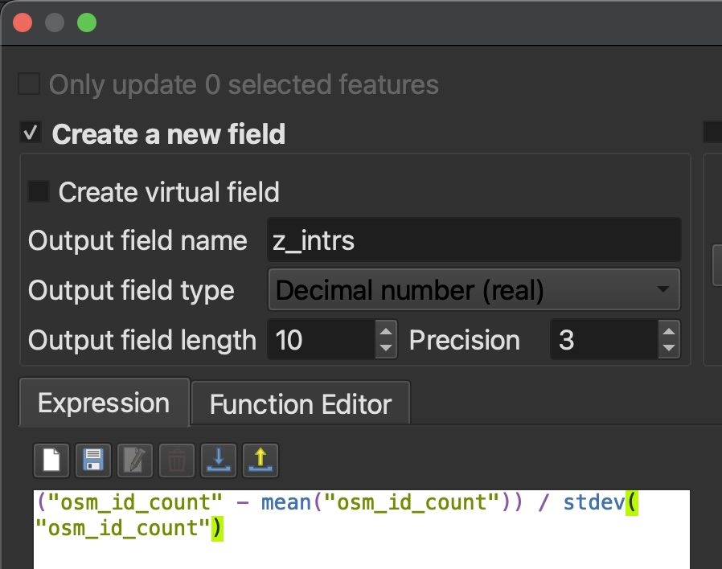

<span style="font-size:15px;"> Extract Service Area
</span> 
{: .label .label-step} 
- Extract **Service area (from layer)**
  * Vector layer representing network: *street-network*
  * Path type to calculate: Shortest
  * Vector layer with start points: *block-centroids*
  * Travel cost: 300 
* Save output as ***street-network-buffer*** 
{: .step}

<span style="font-size:15px;"> Buffer network inputs and join attributes
</span>
{: .label .label-step} 
- Run a 50m **Buffer** on the pre-processed *businesses* layer. Do **not** dissolve result. 
- **Join attributes by location (summary)** 
  * Base layer: *street-network-buffer*
  * Join layer: Buffered layer
  * Geometric predicate: intersects
  * Fields to summarize: "businesstype"
  * Summaries to calculate: 'count', 'unique'
  * Right click the output *Join layer* and rename the temporary layer to *businesstype* without saving it
  * Remove *Buffered*
- Run a 50m **Buffer** on the processed layer *street_intersections*. Do **not** dissolve result. 
- **Join attributes by location (summary)** 
  * Base layer:  *street-network-buffer*
  * Join layer: Buffered layer
  * Geometric predicate: intersects
  * Fields to summarize: "osm_id"
  * Summaries to calculate: 'count'   
  * Rename the output *Join layer* to *osm*
  * Remove *Buffered* layer   
- **Join attributes by location (summary)** 
  * Base layer: *street-network-buffer*
  * Join layer: *census*
  * Fields to summarize: "pop_den"
  * Summaries to calculate: 'mean'
  * Rename the output *Join layer* to *popden*
- Now we need to run a series of joins to merge the field calculations performed above into one attribute table.
- Run **Join attributes by field value** on the temporary join layer you named *businesstype* 
  * Input layer: *businesstype*
  * Table field: geo_point_2d
  * Input layer 2: *osm*
  * Table field 2: *geo_point_2d*
  * Layer 2 fields to copy: *osm_id_count*
  * Open the attribute table of the resulting *Joined layer* and ensure that *osm_id_count* now appears beside "businesstype_unique" and "businesstype_count"
- Now run **Join attributes by field value** on that same *Joined layer* 
  * Input layer: *Joined layer*
  * Table field: geo_point_2d
  * Input layer 2: *popden*
  * Table field 2: *geo_point_2d*
  * Layer 2 fields to copy: *pop_den_mean*
  * The output *Join layer* will be highlighted in the layers panel. Save it as a permanent layer called **Network-Buffers_Joined**
  * Remove all temporary layers and save your QGIS project
{: .step}


<span style="font-size:15px;"> Join attributes from service area network buffer to urban blocks</span> 
{: .label .label-step}
- Use **Join attributes by field value** to merge field calculations to polygon layer
  * Input layer: *urban-blocks*
  * Table field: geo_point_2d
  * Input layer 2: *Network-Buffers_Joined*
  * Table field 2: geo_point_2d
  * Layer 2 fields to copy: "businesstype_unique", "businesstype_count", "osm_id_count", "pop_den_mean"
- **Clip** *Joined layer* to *Census-DAs* because this is the only are we actually have population information for and therefore complete data. 
  * Save the *Clipped* output to your workshop-data folder and name it **walkability-index** 
{: .step}

<span style="font-size:15px;"> Use <b>Field calculator</b> to calculate Z-scores 
</span> 
{: .label .label-step}
- Open attribute table of *walkability-index* and toggle on editing mode
- Create four new fields by pasting the following calculations into **Field calculator**. For each, change **Output field type** to **Decimal number (real)** and keep precision at 3 places. 
  ```
  Field Name        Calculation
  z_intrs           ("osm_id_count" - mean("osm_id_count")) / stdev("osm_id_count")
  z_pop_den         ("pop_den_mean" - mean("pop_den_mean")) / stdev("pop_den_mean")
  z_ret_unique      ("businesstype_unique" - mean("businesstype_unique")) / stdev("businesstype_unique")
  z_ret_count       ("businesstype_count" - mean("businesstype_count")) / stdev("businesstype_count")
  ```

- Create one last field called *walkability* and use <b>Field calculator</b> to sum all normalized indicators
  ```
  (2 * "z_intrs") + "z_pop_den" + "z_ret_unique" + "z_ret_count"
  ```
- Save changes and toggle off editing mode
{: .step}