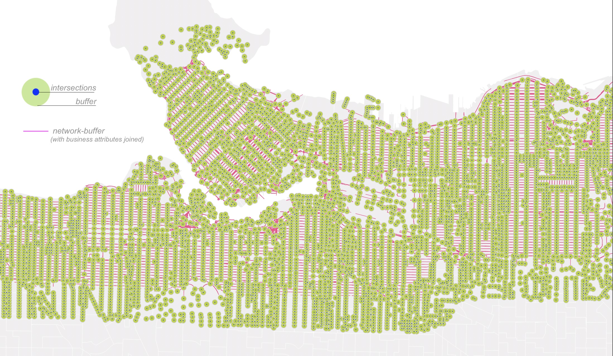

 Extract Service Area
 
{: .label .label-step} 
- Extract **Service area (from layer)**</b>
  * Vector layer representing the network: *street-network*
  * Path type to calculate: Shortest
  * Vector layer with start points: *block-centroids*
  * Travel cost: 600 
- Save output as ***street-network-buffer*** 
    

Buffer network inputs and join attributes
 
- Run a 50m **Buffer** on the pre-processed *businesses* layer. Do **not** dissolve result. 
  * Save Buffered output as ***businesses-buffer50***
- **Join attributes by location (summary)** 
  * Input layer: *street-network-buffer*
  * Join layer: *businesses-buffer50*
  * Geometric predicate: Intersect
  * Fields to summarize: "businesstype"
  * Summaries to calculate: 'count', 'unique'
  -
- Run a 50m **Buffer** on the processed layer *street_intersections*. Do **not** dissolve result. 
  * Save Buffered output as ***intersection-buffer50*** 
  
- **Join attributes by location (summary)** 
  * Input layer:  *street-network-buffer*
  * Join layer: *intersection-buffer50*
  * Geometric predicate: Intersect
  * Fields to summarize: "osm_id"
  * Summaries to calculate: 'count'
  TAKES FOREVER too big an area 
-
- Rename population density column
  * Right-click on *census-DAs* > Properties > Fields > Toggle on editing mode
  * Double-click on Population density per square kilometre, 2016 and type pop_den
  * click Save and toggle editing mode off  
- **Join attributes by location** from <i>census</i> layer
  * Input layer: *street-network-buffer*
  * Join layer: <i>census</i>
  * Field: "population density"
  * Operation: 'mean'

Join attributes from service area to urban blocks (by field)
{: .label .label-step}
- Use <b>Join attributes by field value</b> to merge specific columns 
  * Input layer: <i>urban-blocks</i>
  * Table field: "fid"
  * Input layer 2: *street-network-buffer*
  * Table field 2: "fid"
  * Layer 2 fields to copy: "businesstype_unique", "businesstype_count", "osm_id_count", "pop_den_mean"
{: .step}
