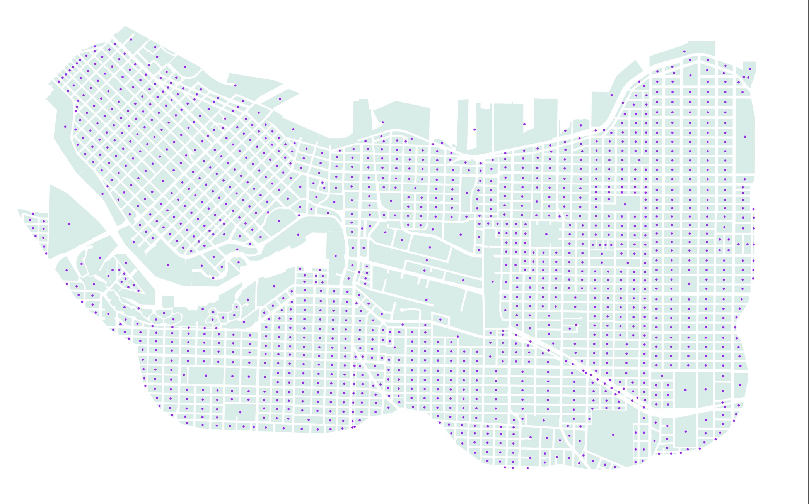
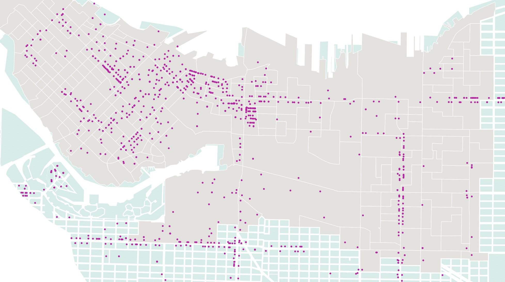

# Pre-processing 
Pre-processing refers to any modification or layer creation you do with your base dataset in order to prepare inputs for your network analysis model. For example, editing attribute tables and fixing geometries, buffering and clipping given data to an area of interest, re-projecting layers etc. 

To skip this step you may find the pre-processed data in the workshop-data subfolder called **pre-processed**. However, if you have the time, processing the data yourself will exercise your geoprocessing skills and provide continuity to your workflow. Projects outside of this workshop will likely require you to pre-process datasets yourself, so it's useful to practice with guided instructions. 
{: .note}

---
*Until specified, all geoprocessing may be run with outputs left as temporary files.*

<!-- *1*{: .circle .circle-purple}  **Process street-network: get intersections** -->
<br>
<span style="font-size:15px;"> Process street network: get intersections</span> 
{: .label .label-step}

- Run the **Line Intersections** tool on <i>street-network</i> 
    *  You can find it under Vector --> Analysis Tools, or simply by searching for it in the Help menu at the top of your screen. You can also open the Processing Toolbox where you can search for all tools.
    * Input layer: <i>street-network</i>
    * Intersection layer: *street-network* 

-  **Buffer (15m)** the resulting <i>Intersections</i> layer and **Dissolve result** 

- Convert the resulting <i>Buffered</i> layer from <b>Multipart to singleparts</b> using the tool by that name

- Find the <b>Centroids</b> of <i>Singlepart parts</i> 

- Export the resulting <i>Centroids</i> layer 
    * Save as ***street-intersections*** in GeoJSON format to your workshop-data folder


                    
- Remove all temporary layers and save your QGIS project
<br><br>
    
{: .step}

    
<br>
<span style="font-size:15px;"> Process urban blocks: get centroids</span> 
{: .label .label-step}
- Run <b>Centroids</b> on *urban-blocks* 
    * save the output as ***block-centroids*** to your workshop-data folder in .geoJSON format
  
{: .step}  

<br>
<span style="font-size:15px;"> Extract valid business licenses by type</span> 
{: .label .label-step}
* Add *business-licenses.geojson* to your map canvas. It may take a moment to load. For the purposes of this workshop we are only interested in the set of businesses that are retail dealers and have a valid (non-expired) license. Let's run some expressions to select businesses based on these parameters...    

* **Open the attribute table**. This will take a moment as well since nearly 300,000 features are being loaded.

* Open <b>Select by expression</b>. In the middle panel of the dialogue box is a list of input options. Expand **Fields and Values**, **Date and Time**, and **Operators**    

* To select only valid licences, double-click the Field *expireddate*, then the **>** Operator, then **to_date** from the Date and Time functions, and enter today's date in single quotes inside the parentheses.    
```
"expireddate" >  to_date('2023-07-18')
```    
* We can select for walkability-related businesses in the same expression. Double click the AND Operator and, from the bottom of the expression builder, an open bracket. We are interested in retail businesses that are food and drink related; that is, retail dealers of food or grocery. Enter the following values for the field *businesstype* using the `=` and `or` Operators. Make sure to enter *businesstype* for each value. Close the bracket.         
Your Expression should look as follows:
```sql
"expireddate" > to_date('2023-07-18')  AND  
("businesstype"  =  'Retail Dealer' or 
"businesstype" =  'Retail Dealer - Food' or  
"businesstype"  = 'Retail Dealer - Grocery')
```
* Click **select features** at the bottom right of the dialogue box to run the query. Return to the attribute table. Your expression should select 1765 features. (*Note that the number of selected features will differ depending on the expiration date set.*) You can change the view layout of your attribute table to **show selected features** from the bottom left corner of the dialogue box.    

- Return to the map canvas. From the layers panel, right click *business-licenses* and go to Export > **Save Selected Features As**
    * Keep the output format as GeoJSON
    * Set the CRS to the Project CRS(EPSG:26910 - NAD83/UTM zone 10N) 
    * Now save the layer as ***businesses*** to your workshop-data folder

* Remove *business-licences* from the Layers panel. 

{: .step}

--- 
You should now have the following additional layers in your workshop-data folder:

- street-intersections
- block-centroids
- businesses

These processed layers will be used in the network analysis we will perform next. We will also use the following layers already provided: 

- street-network
- urban-blocks
- census-DAs

**If you have all these layers, continue to the next section.** If not, review the documentation above, or find the layers you need in the *pre-processed* folder of your workshop-data. 
