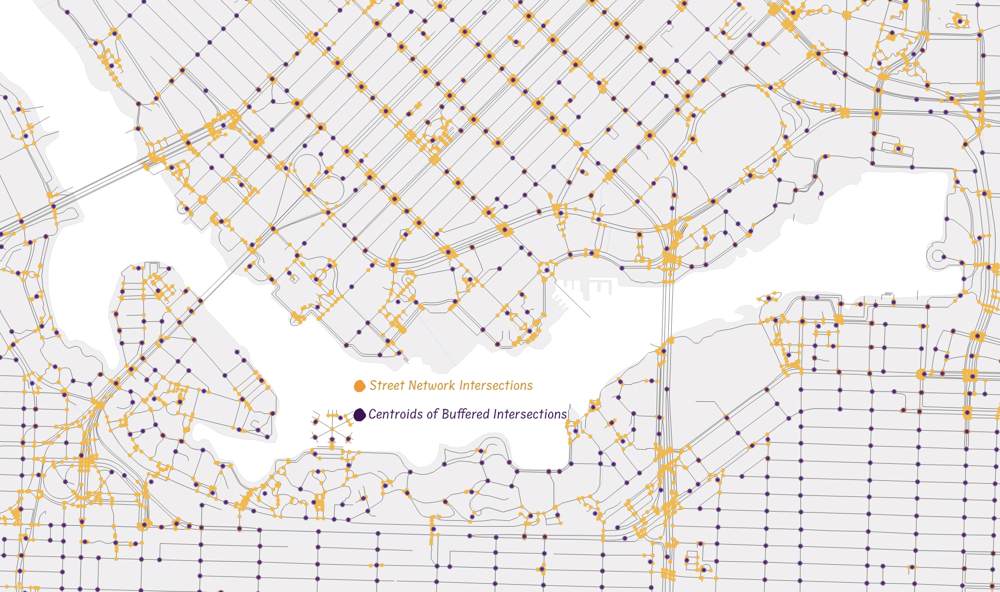

 Process street network: get intersections 
{: .label .label-step .purple}

* Until specified, all output files can be temporary files. 
* Run **Line Intersections** tool on <i>street-networks</i>. You can find it under Vector --> Analysis Tools, or simply by searching for it in the Help menu at the top of your screen. Both the Input and Intersection layer will be <i>street-network</i>
* On the resulting <i>Intersections</i>, run a 15m <b>Buffer</b> selecting the option to **Dissolve result** 
* Convert  the resulting <i>Buffered</i> from <b>Multipart to singleparts</b> using the tool by that name. Find it under Vector --> Geometry Tools, or by searching the Help menu. 
* Find <b>Centroid</b> of <i>Singlepart arts</i>. The Centroid tool is also under Vector --> Geometry Tools.   

* Export the resulting <i>Centroids</i> as ***street-intersections*** in GeoJSON format to your workshop-data folder.
* Remove all temporary layers and save your QGIS project
<!-- * <b>Extract by locations</b> intersections (within boundary unce. boundary isnt aerial buffer? if so, would have had to find centroids of intersections within that area - this step is unclear whether it wants intersections or buffer centroids - going with centroids for now) maybe can just skip this?  -->
{: .step}
