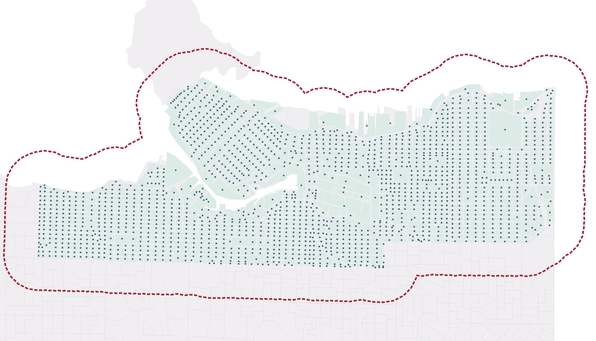

# Walkability Index
what is it and how will we get there
apply spatial network analysis tools in QGIS to estimate and visualize a walkability index based on open data
Urban blocks will be used as samples, so in the end, each block will be scored with a walkability index.
workflow overview 
preprocesss, do network analysis (agreggate)/analyzie - Visualize 


## Pre-processing 
Before we can perform spatial network analysis we first must run some geoprocessing 


- urban-blocks.geojson
- street-networks.geojson
- business-licenses.geojson

To skip the preprocessing step, download -- create zip from GitHub.
{: .warn}

---
layout: default
title: Directions
nav_order: 6
parent: Processing
---

<span style="font-size:15px;"> Process street network: get intersections</span> 
{: .label .label-step}

* Until specified, all output files can be temporary files. 
* Run **Line Intersections** tool on <i>street-networks</i>. You can find it under Vector --> Analysis Tools, or simply by searching for it in the Help menu at the top of your screen. Both the Input and Intersection layer will be <i>street-network</i>
* On the resulting <i>Intersections</i>, run a 15m <b>Buffer</b> selecting the option to **Dissolve result** 
* Convert  the resulting <i>Buffered</i> from <b>Multipart to singleparts</b> using the tool by that name. Find it under Vector --> Geometry Tools, or by searching the Help menu. 
* Find <b>Centroid</b> of <i>Singlepart arts</i>. The Centroid tool is also under Vector --> Geometry Tools. <br><br>

* Export the resulting <i>Centroids</i> as ***street-intersections*** in GeoJSON format to your workshop-data folder.
* Remove all temporary layers and save your QGIS project
<!-- * <b>Extract by locations</b> intersections (within boundary unce. boundary isnt aerial buffer? if so, would have had to find centroids of intersections within that area - this step is unclear whether it wants intersections or buffer centroids - going with centroids for now) maybe can just skip this?  -->
{: .step}


<span style="font-size:15px;"> Process urban blocks: get centroids</span> 
{: .label .label-step}

* Run the <b>Centroid</b> tool on *urban-blocks*
* <b>Buffer</b> and dissolve <i>Centroids</i> (800m)
* Export both output layers to your workshop-data folder in geoJSON format,<br> 
 named ***block-centroids*** and ***boundary*** respectively 

{: .step}


<span style="font-size:15px;"> Process business licenses</span> 
{: .label .label-step}
* <b>Extract by expression</b> only valid licenses
```
"expireddate" >  to_date('2020-07-17’)
```
* <b>Extract by expression</b> walkability-related business types
```
"businesstype" = 'Retail Dealer' or "businesstype" = 'Retail Dealer - Food' or "businesstype" = 'Retail Dealer - Grocery' or "businesstype" = 'Retail Dealer - Market Outlet' or "businesstype" = 'Liquor Retail Store'
```
* <b>Reproject</b> business licenses
* <b>Extract by locations</b> points within analyzed boundary
* Drag and drop Businesses to GeoPackage
{: .step}
