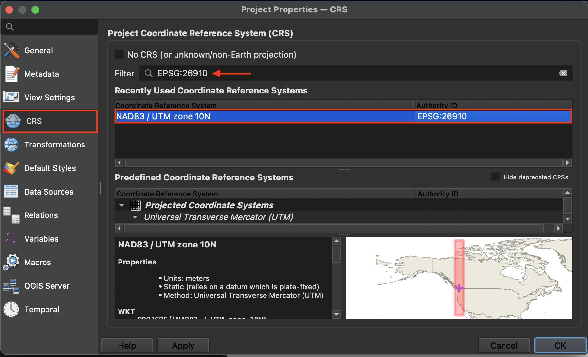
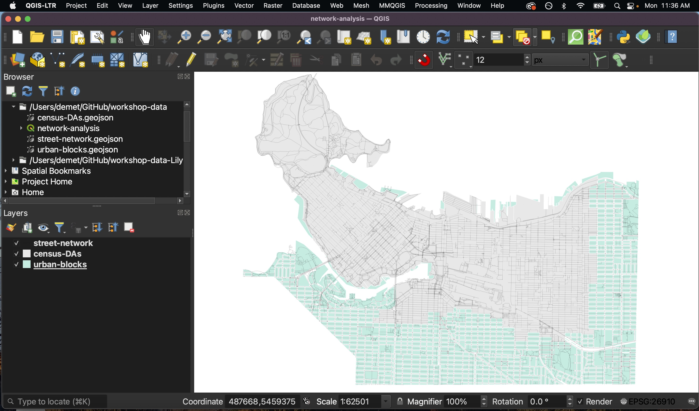

# Setting up a QGIS Project 
 
*1*{: .circle .circle-purple} Open a new QGIS project file (.qgz) and save it to your workshop-data folder as     
"network-analysis_YOUR_NAME"
 
     
*2*{: .circle .circle-purple} From the **Project** menu at the top of your screen navigate to **Properties**. Set your project CRS to EPSG:26910 - NAD83 UTM zone 10N
   

     
 
*3*{: .circle .circle-purple} In the Browser panel to the left of your screen, right click "Favorites" and connect the workshop-data folder as a favorite directory. Once connected, expand the folder to see its contents. 
     
 
*4*{: .circle .circle-purple} Add the following layers **in order** to your map canvas so that streets are the last layer to be added: 

- urban-blocks.geojson
- census-DAs.geojson
- street-network.geojson

The automatic symbology (i.e. styling) given to your layers may differ - feel free to change it now. 

<b>Increasing Icon and Font Size</b> If you find the current icon and font sizes of your QGIS interface to be too small, you can increase them. Go to the **Settings** menu at the top of your screen and click on **Options**  
Resize the dialogue box so you can see the drop-down for "icon size" and "font." Icon changes will happen as soon as you click OK. Changes in font size won't update until you quit and restart QGIS, so make sure you save your project now.
{: .note}
