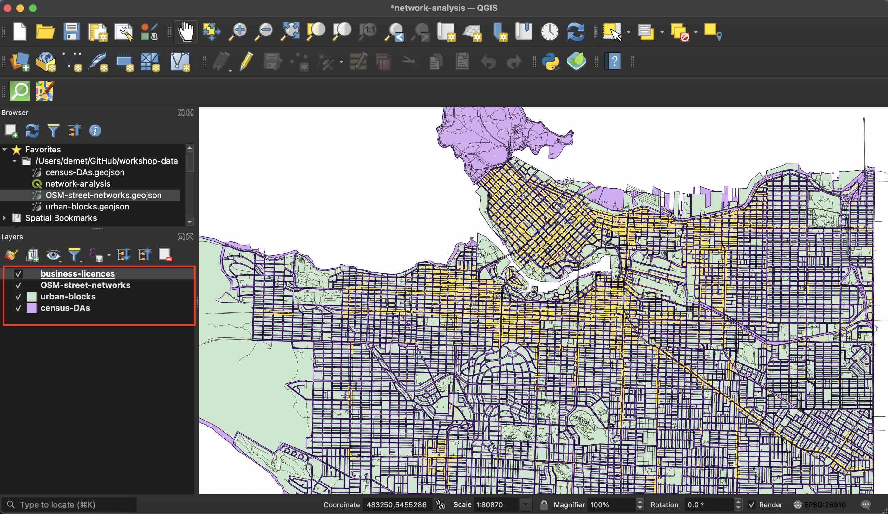

# Setting up a QGIS Project 
 
*1*{: .circle .circle-purple} Open a new QGIS project file (.qgz) and save it as "network-analysis_YOUR_NAME"
 
     
*2*{: .circle .circle-purple} From the **Project** menu at the top of your screen navigate to **Properties**. Set your project CRS to EPSG:26910 - NAD83 UTM zone 10N
   

     
 
*3*{: .circle .circle-purple} In the Browser panel to the left of your screen, right click "Favorites" and connect your workshop-data folder as a favorite directory. Once connected, expand the folder to see its contents. 
     
 
*4*{: .circle .circle-purple} Add the workshop data **in the following order:** 

- census-DAs.geojson
- urban-blocks.geojson
- OSM-street-networks.geojson
- business-licenses.geojson

We add census-DAs.geojson first because it has the same CRS as the project. Urban-blocks does not have the same CRS as your project and, unless the option is disabled, QGIS will automatically change your project projection to that of the first layer added. OSM-street-networks and especially business-licenses are very large files and will take a minute to load. 

Though the automatic symbology of your layers may differ, your map canvas should now resemble the image below. **Re-order your layers to match.**
        

